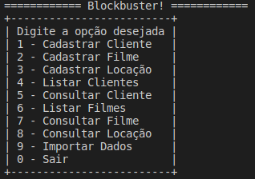

# CSharp: Simple Blockbuster
A mini blockbuster to exemplify the basic structure of C#

## Run locally

### Prerequisites
- .NET Core

### Steps
1. `dotnet run`

It's a simple console execution :laughing:

  

